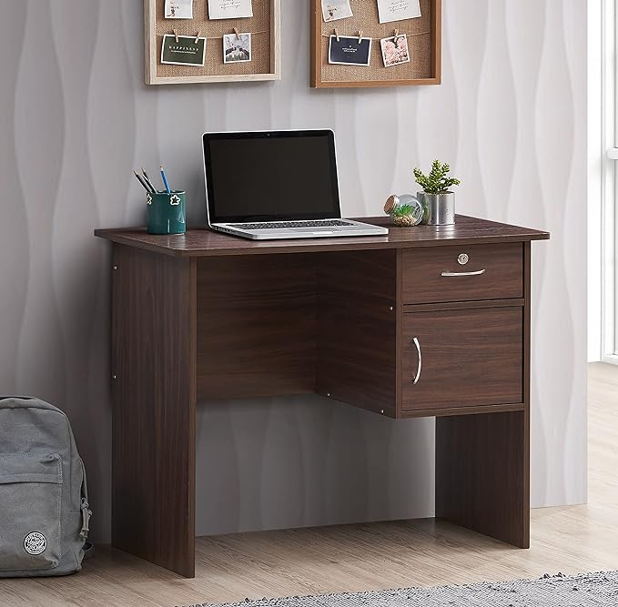

# Object Manipulation with Segmentation and Inpainting

This project demonstrates object segmentation and shifting using **GroundingDINO**, **Segment Anything (SAM)**, and **Stable Diffusion Inpainting** models. The objective is to segment objects from an image, shift them to new positions, and fill in the gaps with a reasonable background using inpainting techniques.

## Approach

We use a combination of state-of-the-art models:
1. **GroundingDINO**: For object detection and bounding box generation.
2. **Segment Anything (SAM)**: To generate precise masks for the detected object.
3. **Stable Diffusion Inpainting**: To fill in the background after the object is shifted to a new position.

### Steps:
1. **Object Detection**: GroundingDINO is used to identify the object class and generate bounding boxes.
2. **Segmentation**: SAM generates a mask for the detected object.
3. **Object Shifting**: We shift the detected object based on user-provided coordinates (X and Y shifts).
4. **Inpainting**: We use Stable Diffusion to inpaint the region from which the object was shifted, filling the gaps with background content.

## Execution Instructions

### Prerequisites
- Install the required packages:
    ```bash
    pip install torch torchvision diffusers opencv-python
    ```
- Download the models for **GroundingDINO** and **Segment Anything (SAM)**:
    - GroundingDINO: `groundingdino_swinb_cogcoor.pth`
    - SAM: `sam_vit_h_4b8939.pth`
  
  Place them in the `models/` directory.

### Running the Script

To run the script, use the following command:

For masking the object:

```bash
!python run.py --image /path/to/your/image.jpeg --class "your_object_class" --output /path/to/output_image.png
```
For Shifting the object:

```bash
!python run.py --image /path/to/your/image.jpeg --class "your_object_class" --output /path/to/output_image.png --x <shift_x_pixels> --y <shift_y_pixels>
```

## Results and Analysis

### Example 1: Shifting a Backpack

- **Input Image**: A desk with a backpack beside it.


- **Prompt**: "backpack"
- **Shift**: -150 pixels in the X direction.
- **Output**: The backpack was shifted further left, mostly out of view, but the inpainting filled the gap with a somewhat unnatural blur in the region where the backpack was originally located.

#### Issues:
- The inpainted background was slightly blurred, making it obvious that a modification had been made.
- The background texture (wooden floor and shadow) was not perfectly restored.

#### Improvements:
- A more sophisticated inpainting model such as LaMa could handle complex background textures more effectively.
- Tighter mask generation could minimize excessive inpainting beyond the necessary region.

---

### Example 2: Shifting a Dog

- **Input Image**: A dog running in the grass.
- **Prompt**: "dog"
- **Shift**: -150 pixels in the X direction.
- **Output**: The dog was successfully shifted to the left. The inpainting did a decent job at filling in the grassy background, though some minor artifacts were noticeable where the dog had been.

#### Success:
- Grass is a relatively simple texture, and Stable Diffusion was able to inpaint it fairly well.
- The shift was smooth, and the object was placed naturally in the new position.

#### Potential Improvements:
- For better texture alignment in complex scenes, combining multiple inpainting techniques could yield better results.
- Using more detailed prompts for the inpainting model (e.g., "grassy background, no dog") could improve the results in more challenging scenes.

---

### Example 3: Shifting a Dog with Complex Prompt

- **Input Image**: Same dog running in grass.
- **Prompt**: "dog, jumping, action"
- **Shift**: -200 pixels in the X direction.
- **Output**: The shift moved the dog to the far left, but the background fill still had minor distortions in the grass. However, the overall object alignment was quite successful.

#### Challenges:
- The texture consistency in the inpainted grass was slightly off, leading to minor visual artifacts.
- Further refinement in texture and alignment was needed for smoother blending.

---

### Observations

#### Successes:
- The segmentation with **SAM** was quite accurate, and it produced clean masks.
- Stable Diffusion’s inpainting worked well with simple backgrounds like grass.

#### Failures:
- For more complex textures, such as wooden desks or patterned shadows, the inpainting left behind visible artifacts or blurry regions.
- When shifting an object, the size and resolution of the object sometimes mismatched the inpainted background, leading to misalignment.

---

### Potential Future Improvements

1. **Advanced Inpainting**: Using more advanced inpainting techniques like LaMa or inpainting models with context awareness can help resolve complex backgrounds.
2. **Better Masking**: Tighter masks or polygonal masks could prevent excessive areas from being inpainted, leading to better blending with the surrounding background.
3. **Blending Techniques**: Post-processing with blending (e.g., feathering the mask edges) could make the transition between the object and the inpainted background smoother.
4. **Scene Context Awareness**: Prompt-based inpainting could include more detailed contextual information about the missing background to ensure better completion (e.g., "wooden floor, shadows, no backpack").
5. **Pose Manipulation**: In addition to shifting objects, adding support for changing the object’s pose or orientation would be an interesting extension.

---

## Conclusion

This project showcases how modern deep learning models can be combined for object manipulation tasks like segmentation, shifting, and inpainting. While the approach works well for simple cases, more complex scenarios require improved inpainting techniques and tighter control over the mask and background filling processes.

Feel free to experiment with different images, shifts, and objects to see how the system performs in different contexts!
